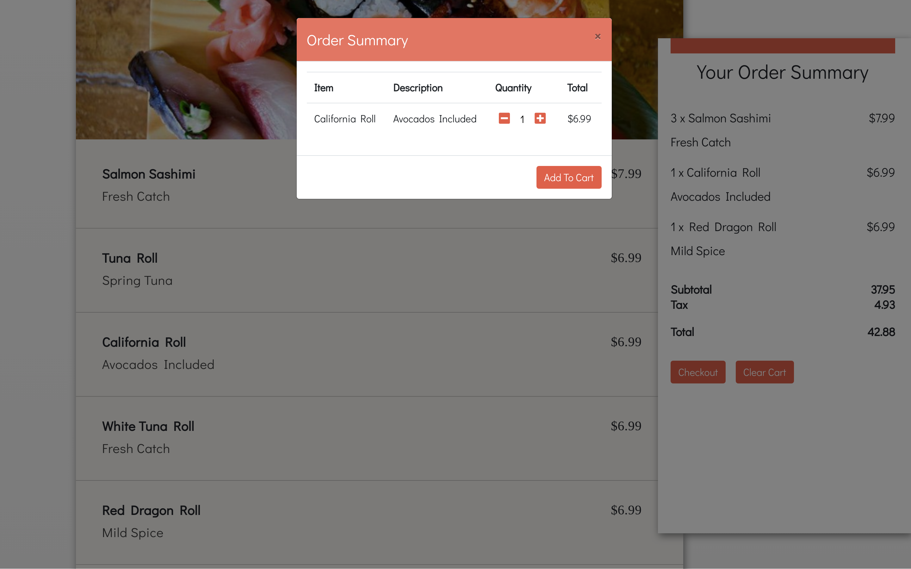

About Caterly
=========
Caterly is a fullstack web application that was built with Node.js, Express.js, Scss, HTML5, JQuery, EJS, Twillio API and backend Postgres relational database. It is a web based food ordering system inspired by Ritual which allows user to view/modify orders and receive notification for pickup time once an order has been placed in the queue

## Getting Started
1. Create the `.env` by using `.env.example` as a reference: `cp .env.example .env`
2. Update the .env file with your correct local information 
  - username: `labber` 
  - password: `labber` 
  - database: `midterm`
3. Install dependencies: `npm i`
4. Fix to binaries for sass: `npm rebuild node-sass`
5. Reset database: `npm run db:reset`
  - Check the db folder to see what gets created and seeded in the SDB
7. Run the server: `npm run local`
  - Note: nodemon is used, so you should not have to restart your server
8. Visit `http://localhost:8080/`

## Screenshots

## Dependencies
chalk: 2.4.2,  
cookie-parser: 1.4.4,  
cookie-session: 1.3.3,  
dotenv: 2.0.0,  
ejs: 2.6.2,  
express: 4.17.1,  
js-cookie: 2.2.1,  
method-override: 3.0.0,  
moment: 2.24.0,  
morgan: 1.9.1,  
node-sass-middleware: 0.11.0,  
pg: 6.4.2,  
pg-native: 3.0.0,  
strftime: 0.10.0,  
twilio: 3.33.4

